#### 二叉树
##### 二叉树的定义
二叉树是$n(n \geqslant 0)$个结点的有限集合，该集合或者为空集（称为空二叉树），或者由一个根结点和两棵互不相交的，分别称为根结点的左子树和右子树的二叉树组成。

**二叉树**
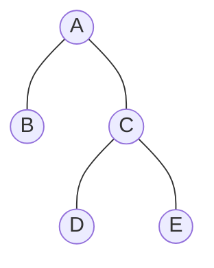

**不是二叉树**
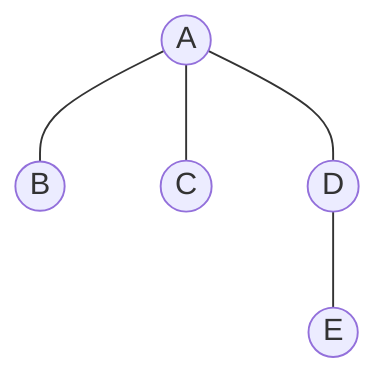
因为结点A有三个子树


##### 二叉树的特点
- 每个结点**最多**有两个子树，所以二叉树不存在度大于2的结点。结点也可以没有子树或者只有一棵子树
- 左子树和右子树是有顺序的，次序不能任意颠倒。
- 即使某个结点只有一棵子树，也**必须**区分它是左子树还是右子树

##### 二叉树的基本形态
- 空二叉树
- 只有一个根结点
- 根节点只有一个左子树
- 根节点只有一个右子树
- 根节点既有左子树，又有右子树

假设有一棵二叉树，有三个结点，那么有几种形态？
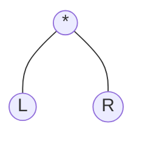

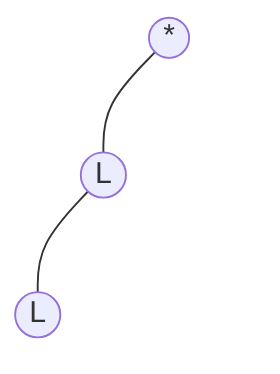
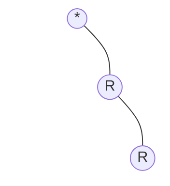

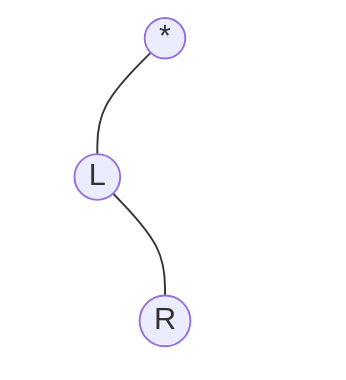

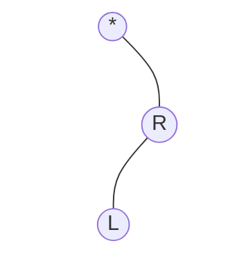

由于有左右枝叶之分，因此有五种形态L表示左枝，R表示右枝

##### 特殊二叉树
1. 斜树
   - 分类
     - 所有结点都只有左枝的叫左斜树
     - 所有结点都只有右枝的叫右斜树
2. 满二叉树
   - 定义
   在一棵二叉树中，如果所有的分支结点都存在左子树和右子树，并且所有叶子都在同一层上，这样的二叉树称之为满二叉树
   - 分类
     1. 叶子结点只能出现在最下层，出现在其它层就不能达成平衡
     2. 非叶子结点的度一定是2，否则不能称之为“满”
     3. 在同样深度的二叉树中，满二叉树的结点个数最多，叶子数最多

**下图就是一个“满”二叉树**
###### 图1
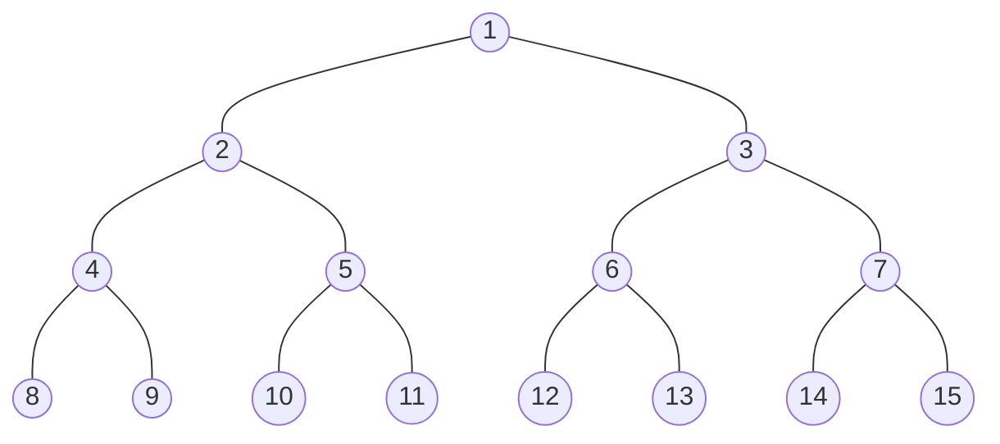


3. 完全二叉树
   - 定义
   对一棵具有n个结点的二叉树**按层序编号**，如果编号为$i(1 \leqslant i \leqslant n)$的结点与同样深度的满二叉树中编号为$i$的结点在二叉树中的**位置**完全相同，则这棵二叉树称为完全二叉树。
   **按层序编号**: 表示从上到下，从左到右编号
   **位置**: 位置不仅仅是层数，还分左右枝
   - 特点
     1. 叶子结点只能出现在最下两层
     2. 最下层的叶子结点一定集中在左部连续位置
     3. 倒数2层所有叶子结点，一定出现在右部连续位置
     4. 如果结点度为1，则结点一定是左孩子
     5. 同样结点数的二叉树，完全二叉树的深度最小

满二叉树一定是一棵完全二叉树，完全二叉树不一定是一棵满二叉树

##### 举例说明
**下图是一个“按层序标号”的二叉树**
###### 图2
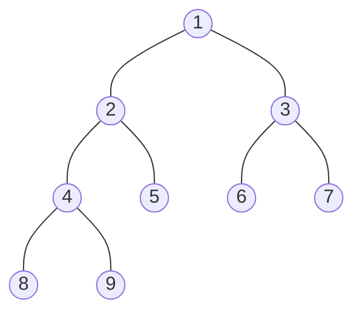

**1. 下图是否是一个完全二叉树（将【图2】二叉树中的6、7结点去除）**
###### 图3
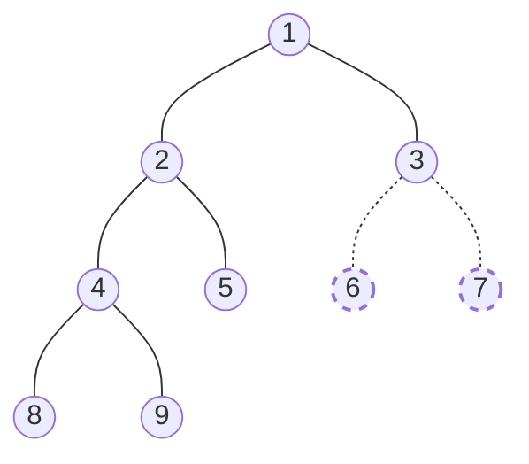
**答案是：** 它**不是**一棵完全二叉树
**原因：**
完全二叉树有一个前提就是，**按层序编号**后，与满二叉树的编号相同的结点，位置相同，尝试将 **【图2】二叉树** 中的6、7结点去除后，重新编号,如下图
###### 图4
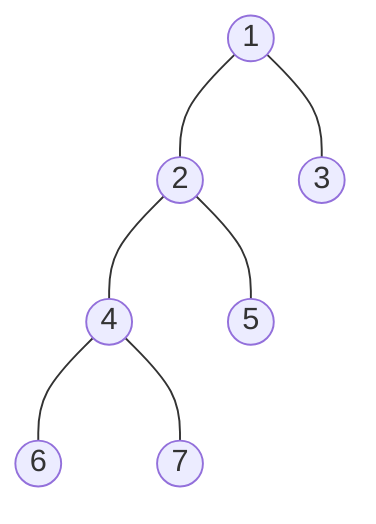
可以看到编号为6、7的结点和满二叉树 **【图1】** 的结点位置不相同，因此，这棵树不是完全二叉树

**2. 下图是否是一个完全二叉树（将【图2】二叉树的8结点去除）**
###### 图5
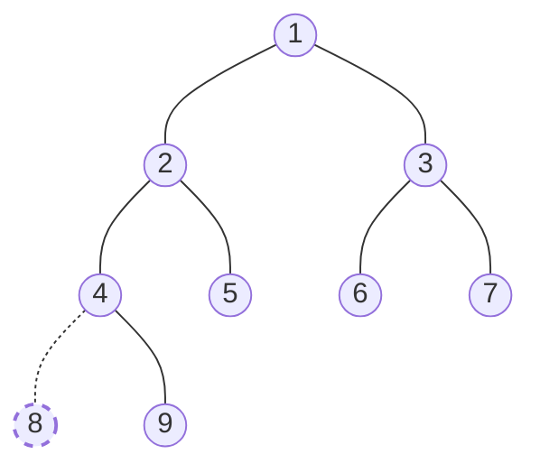
**答案是：** 它**不是**一棵完全二叉树
同样思路，尝试将 **【图2】二叉树** 中的8结点去除后，重新编号,如下图
###### 图6
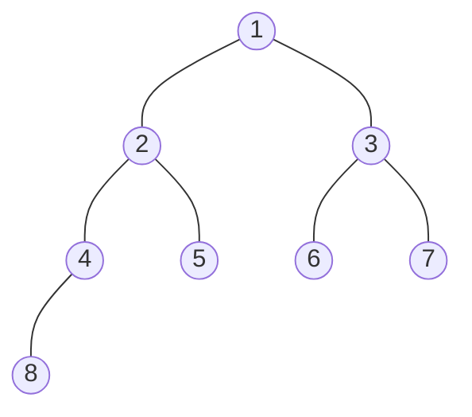
可以看到编号为8的结点和 **【图1】满二叉树** 的结点位置不相同，因此，这棵树不是完全二叉树。因为二叉树是分左枝和右枝的，这里去除的8是左枝，因此现在的8其实是右枝，所以和满二叉树的位置不同

**3. 下图是否是一个完全二叉树（将上【图2】二叉树中的8、9结点都去除）**
###### 图7
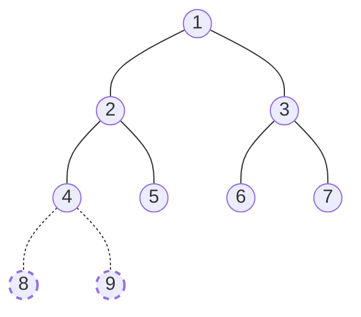
**答案是：** 它**是**一棵完全二叉树
同样思路，尝试将 **【图2】二叉树** 中的8、9结点去除后，重新编号,如下图
###### 图8
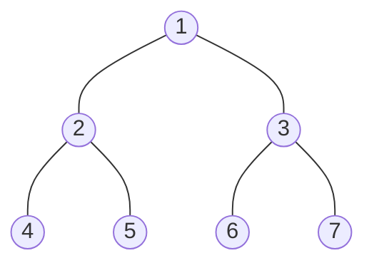
可以看到，所有结点和 **【图1】满二叉树** 结点完全一致。

###### 二叉树的性质
**性质1.** 在二叉树的第i层上至多有$2^{i-1}$个结点$(i \geqslant 1)$
**性质2.** 深度为k的二叉树，至多有$2^k-1$个结点$(i \geqslant 1)$
**性质3.** 对任何二叉树T，如果其**终端结点**数为$n_0$，度为2的结点数为$n_2$，则$n_0=n_2+1$

**证明：**
终端结点即叶结点，也可以理解为度为0的结点
设度为0的结点数为$n_0$，度为1的结点数为$n_1$，度为2的结点数为$n_2$，则结点的总数为：$$n=n_0+n_1+n_2 \qquad \dotsb \bold{式一}$$ 这是按照结点来算。
其次按照度来算，每个度为2的结点，说明在该结点下有2个结点，每个度为1的结点，说明在该结点下有1个结点，
那么结点的总数可以表示为$度为2的结点数n_2 × 2 + 度为1的结点数n_1 × 1 + 度为0的结点数n_0 × 0 + 1(根结点)$ 即 $$n=(n_2×2)+(n_1×1)+0+1 \qquad \dotsb \bold{式二}$$
**式一、式二连列得**
$$n_0+n_1+n_2=(n_2×2)+(n_1×1)+0+1$$
**整理得**
$$n_0=n_2+1$$

**性质4.** 具有n个结点的完全二叉树的深度为$[\log_2^n]+1$，$[X]$表示不大于$X$的最大整数
**说明**
深度为k的满二叉树结点数为n，满足$n=2^k-1$，因为第一层只有1个结点，不是两个，或者也可以写成$n=2^{k-1}+1$，则深度k满足$k=\log_2^{n+1}$
完全二叉树的结点数一定小于或者等于满二叉树的结点数$2^k-1$，但一定大于$2^{k-1}-1$
因为深度为k的最少结点数，应该是深度为k-1的**满二叉树**结点数+1，深度为k-1的**满二叉树**的结点数为$2^{k-1}-1$。即满足$2^{k-1}-1 < n \leqslant 2^k-1$。
$∵结点数n是整数$
消除常数项 $∴n \leqslant 2^k-1$ 推导出 $n < 2^k$
消除常数项 $∴n > 2^{k-1} - 1$ 推导出 $n \geqslant 2^{k-1}$
$∴2^{k-1} \leqslant n < 2^k$
两边取对数，得
$k-1 \leqslant \log_2^n < k$
k作为深度也为整数
$∴k=\log_2^n+1$

**性质5.** 如果对一棵有n个结点的完全二叉树（其深度为$[\log_2^n]+1$）的结点按层序编号（从第1层到第$[\log_2^n]+1$层，每层从左到右），对任意结点$i (1 \leqslant i \leqslant n)$有：
1. 如果$i=1$，则$i$是二叉树的根，无双亲；如果$i>1$，其双亲是结点$[\dfrac{i}{2}]$
2. 如果$2×i>n$，则结点$i$无左孩子，结点$i$为叶子结点。否则其左孩子时结点为$2×i$
3. 如果$2×i+1>n$，则结点$i$无右孩子，否则其右孩子结点为$2×i+1$

**性质可以配合下图理解**


##### 二叉树的顺序存储结构
二叉树的顺序结构就是用一维数组存储二叉树中的结点，并且结点的存储位置可以体现结点之间的逻辑关系，比如双亲与孩子的关系，左右兄弟关系等。
顺序存储结构一般用于**完全二叉树**。

##### 二叉树的链表存储结构
二叉树的每个结点最多有两个孩子，所以为它设计一个数据域和两个指针域是比较自然的想法，我们称这样的链表叫**二叉链表**

```go
type BiNode struct{
    data int32
    lchild,rchild *BiNode
}
```
如果有需要还可以增加一个指向双亲的指针域，这样就称之为**三叉链表**

##### 二叉树的遍历
二叉树的遍历（traversing binary tree）是指从根结点出发，按照**某种次序**依次访问二叉树中的所有结点，使得每个结点被访问一次，且**仅被访问一次**。

###### 二叉树的遍历方式
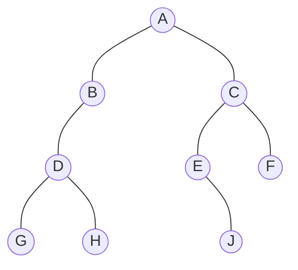
1. 前序遍历
（根在前，从左往右，一棵树的根永远在左子树前面，左子树又永远在右子树前面）
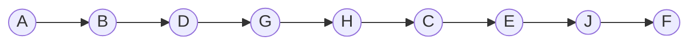
代码示例：
```go
// Node定义
type Node struct{
    int *data
    left *Node
    right *Node
    parent *Node
}
// 递归写法
func pre_order(root *Node){
    if root==nil {
        return
    }
    fmt.Println(root.data)
    pre_order(root.left)
    pre_order(root.right)
}
```


1. 中序遍历
（根在中，从左往右，一棵树的左子树永远在根前面，根永远在右子树前面）
图如下

其实：中序遍历可以想象成，按树画好的左右位置投影下来就可以了
如上图树所示，D子树投影到平面的顺序为 G - D - H
B投影到平面在H的后面
A投影到平面在B的后面
E投影到平面在A的后面，J的前面
J投影到平面在E的后面
C投影到平面在J的后面
F投影到平面在C的后面
形成的映射图如下，这也就是遍历顺序：
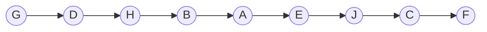

代码示例：
```go
// Node定义
type Node struct{
    int *data
    left *Node
    right *Node
    parent *Node
}
// 递归写法
func middle_order(root *Node){
    if root==nil {
        return
    }
    middle_order(root.left)
    fmt.Println(root.data)
    middle_order(root.right)
}
```

3. 后序遍历
（根在后，从左往右，一棵树的左子树永远在右子树前面，右子树永远在根前面）
```mermaid
graph TD
A((A))
B((B))
C((C))
D((D))
E((E))
F((F))
G((G))
H((H))
empty1(( ))
empty2(( ))
J((J))
A---B
A---C
B---D
B-.-empty1
C---E
C---F
D---G
D---H
E-.-empty2
E---J
%%下方修改透明，为了体现出二叉树的左右枝，第几条线是从上到下，从左到右开始数，从0开始%%
%%修改第3条线样式为透明%%
linkStyle 3 stroke:transparent
%%修改第empty1结点样式为透明%%
style empty1 stroke:transparent,fill:transparent

%%修改第8条线样式为透明%%
linkStyle 8 stroke:transparent
%%修改第empty2结点样式为透明%%
style empty2 stroke:transparent,fill:transparent
```

可以看成从最左段的子树开始剪枝，从左往右，先剪叶子后剪枝，最后就只剩根了
例如上图的树结构，开始剪
先剪G - H
D上没有叶子了，再剪D
B上没有枝了，再剪B
根的左枝剪完了，开始剪右枝
先剪J
E上没有叶子了，再剪E
再剪F
C上没有枝叶了，再剪C
A上没有枝叶了，再剪A
最终遍历顺序如下
```mermaid
graph LR
A((A))
B((B))
C((C))
D((D))
E((E))
F((F))
G((G))
H((H))
J((J))
G --> H --> D --> B --> J --> E --> F --> C --> A
```

代码示例：
```go
// Node定义
type Node struct{
    int *data
    left *Node
    right *Node
    parent *Node
}
// 递归写法
func middle_order(root *Node){
    if root==nil {
        return
    }
    middle_order(root.left)
    middle_order(root.right)
    fmt.Println(root.data)
}
```

1. 层序遍历
（是按照从上到下，从左到右的顺序遍历。）
```mermaid
graph TD
A((A))
B((B))
C((C))
D((D))
E((E))
F((F))
G((G))
H((H))
empty1(( ))
empty2(( ))
J((J))
A---B
A---C
B---D
B-.-empty1
C---E
C---F
D---G
D---H
E-.-empty2
E---J
%%下方修改透明，为了体现出二叉树的左右枝，第几条线是从上到下，从左到右开始数，从0开始%%
%%修改第3条线样式为透明%%
linkStyle 3 stroke:transparent
%%修改第empty1结点样式为透明%%
style empty1 stroke:transparent,fill:transparent

%%修改第8条线样式为透明%%
linkStyle 8 stroke:transparent
%%修改第empty2结点样式为透明%%
style empty2 stroke:transparent,fill:transparent
```

如上图数所示
第一层 A
第二层 B,C
第三层 D,E,F
第四层 G,H,J
因此遍历顺序为：
```mermaid
graph LR
A((A))
B((B))
C((C))
D((D))
E((E))
F((F))
G((G))
H((H))
J((J))
A --> B --> C --> D --> E --> F --> G --> H --> J
```


2. 中序遍历
从根节点开始，中序遍历访问根结点的左子树，然后是访问根结点，最后中序遍历右子树。

（可以看成将画好的树从左到右投影到X轴平面上）
```mermaid
graph TD
A((A))
B((B))
C((C))
D((D))
E((E))
F((F))
G((G))
H((H))
empty1(( ))
empty2(( ))
J((J))
A---B
A---C
B---D
B-.-empty1
C---E
C---F
D---G
D---H
E-.-empty2
E---J
%%下方修改透明，为了体现出二叉树的左右枝，第几条线是从上到下，从左到右开始数，从0开始%%
%%修改第3条线样式为透明%%
linkStyle 3 stroke:transparent
%%修改第empty1结点样式为透明%%
style empty1 stroke:transparent,fill:transparent

%%修改第8条线样式为透明%%
linkStyle 8 stroke:transparent
%%修改第empty2结点样式为透明%%
style empty2 stroke:transparent,fill:transparent
```
投影编号如下(注：每个子树的根结点的投影位置一定在子树的右侧)：
```mermaid
graph TD
A((A,5))
B((B,4))
C((C,8))
D((D,2))
E((E,6))
F((F,9))
G((G,1))
H((H,3))
empty1(( ))
empty2(( ))
J((J,7))
A---B
A---C
B---D
B-.-empty1
C---E
C---F
D---G
D---H
E-.-empty2
E---J
linkStyle 3 stroke:transparent
style empty1 stroke:transparent,fill:transparent

linkStyle 8 stroke:transparent
style empty2 stroke:transparent,fill:transparent
```

因此遍历顺序为：
```mermaid
graph LR
A((A))
B((B))
C((C))
D((D))
E((E))
F((F))
G((G))
H((H))
J((J))
G --> D --> H --> B --> A --> E --> J --> C --> F
```

3. 后续遍历：
按照从叶到根的顺序遍历访问左子树，然后同样的方式遍历右子树，最后是根

(可以理解成从左到右的子树，先剪叶子，等叶子剪完了再剪根)
剪顺序如下
```mermaid
graph TD
A((A,9))
B((B,4))
C((C,8))
D((D,3))
E((E,6))
F((F,7))
G((G,1))
H((H,2))
empty1(( ))
empty2(( ))
J((J,5))
A---B
A---C
B---D
B-.-empty1
C---E
C---F
D---G
D---H
E-.-empty2
E---J
linkStyle 3 stroke:transparent
style empty1 stroke:transparent,fill:transparent

linkStyle 8 stroke:transparent
style empty2 stroke:transparent,fill:transparent
```

最终顺序如下：
```mermaid
graph LR
A((A))
B((B))
C((C))
D((D))
E((E))
F((F))
G((G))
H((H))
J((J))
G --> H --> D --> B --> J --> E --> F --> C --> A
```

图的理解相对麻烦，代码就比较容易理解：
```go
// 前序遍历
func PreOrder(root *BinaryTreeNode) {
    if root == nil {
        return
    }
    doSth(root.data) // 这里就是对数据的操作
    PreOrder(root.left)
    PreOrder(root.right)
}
// 中序遍历
func MiddleOrder(root *BinaryTreeNode) {
	if root == nil {
		return
	}
	MiddleOrder(root.left)
	doSth(root.data) // 这里就是对数据的操作
	MiddleOrder(root.right)
}
// 后续遍历
func PostOrder(root *BinaryTreeNode) {
    if root == nil {
        return
    }
    PostOrder(root.left)
    PostOrder(root.right)
    doSth(root.data) // 这里就是对数据的操作
}

// 层序遍历
func LevelOrder(root *BinaryTreeNode) {
    if root == nil {
        return
    }
    doSth(root.data) // 这里就是对数据的操作
    doSth(root.left)
    doSth(root.right)
    LevelOrder(root.left)
    LevelOrder(root.right)
}
```
从代码中可以看出，其实前中后就是在递归时候，实际的数据操作所在的位置。