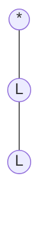
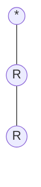
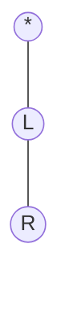
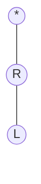
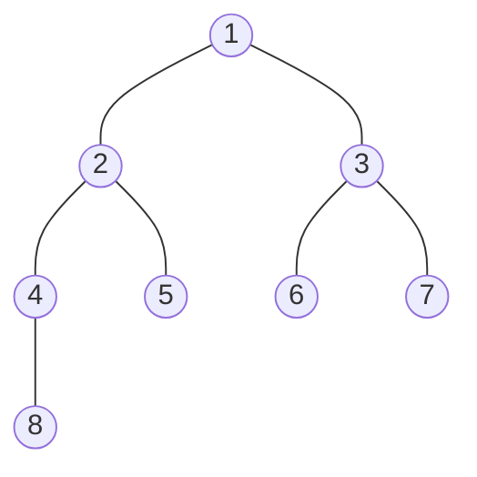

#### 二叉树
##### 二叉树的定义
二叉树是$n(n \geqslant 0)$个结点的有限集合，该集合或者为空集（称为空二叉树），或者由一个根结点和两棵互不相交的，分别称为根结点的左子树和右子树的二叉树组成。

**二叉树**


**不是二叉树**

因为结点A有三个子树


##### 二叉树的特点
- 每个结点**最多**有两个子树，所以二叉树不存在度大于2的结点。结点也可以没有子树或者只有一棵子树
- 左子树和右子树是有顺序的，次序不能任意颠倒。
- 即使某个结点只有一棵子树，也**必须**区分它是左子树还是右子树

##### 二叉树的基本形态
- 空二叉树
- 只有一个根结点
- 根节点只有一个左子树
- 根节点只有一个右子树
- 根节点既有左子树，又有右子树

假设有一棵二叉树，有三个结点，那么有几种形态？









由于有左右枝叶之分，因此有五种形态L表示左枝，R表示右枝

##### 特殊二叉树
1. 斜树
   - 分类
     - 所有结点都只有左枝的叫左斜树
     - 所有结点都只有右枝的叫右斜树
2. 满二叉树
   - 定义
   在一棵二叉树中，如果所有的分支结点都存在左子树和右子树，并且所有叶子都在同一层上，这样的二叉树称之为满二叉树
   - 分类
     1. 叶子结点只能出现在最下层，出现在其它层就不能达成平衡
     2. 非叶子结点的度一定是2，否则不能称之为“满”
     3. 在同样深度的二叉树中，满二叉树的结点个数最多，叶子数最多

**下图就是一个“满”二叉树**
###### 图1


3. 完全二叉树
   - 定义
   对一棵具有n个结点的二叉树**按层序编号**，如果编号为$i(1 \leqslant i \leqslant n)$的结点与同样深度的满二叉树中编号为$i$的结点在二叉树中的**位置**完全相同，则这棵二叉树称为完全二叉树。
   **按层序编号**: 表示从上到下，从左到右编号
   **位置**: 位置不仅仅是层数，还分左右枝
   - 特点
     1. 叶子结点只能出现在最下两层
     2. 最下层的叶子结点一定集中在左部连续位置
     3. 倒数2层所有叶子结点，一定出现在右部连续位置
     4. 如果结点度为1，则结点一定是左孩子
     5. 同样结点数的二叉树，完全二叉树的深度最小

满二叉树一定是一棵完全二叉树，完全二叉树不一定是一棵满二叉树

##### 举例说明
**下图是一个“按层序标号”的二叉树**
###### 图2


**1. 下图是否是一个完全二叉树（将【图2】二叉树中的6、7结点去除）**
###### 图3

**答案是：** 它**不是**一棵完全二叉树
**原因：**
完全二叉树有一个前提就是，**按层序编号**后，与满二叉树的编号相同的结点，位置相同，尝试将 **【图2】二叉树** 中的6、7结点去除后，重新编号,如下图
###### 图4

可以看到编号为6、7的结点和满二叉树 **【图1】** 的结点位置不相同，因此，这棵树不是完全二叉树

**2. 下图是否是一个完全二叉树（将【图2】二叉树的8结点去除）**
###### 图5

**答案是：** 它**不是**一棵完全二叉树
同样思路，尝试将 **【图2】二叉树** 中的8结点去除后，重新编号,如下图
###### 图6

可以看到编号为8的结点和 **【图1】满二叉树** 的结点位置不相同，因此，这棵树不是完全二叉树。因为二叉树是分左枝和右枝的，这里去除的8是左枝，因此现在的8其实是右枝，所以和满二叉树的位置不同

**3. 下图是否是一个完全二叉树（将上【图2】二叉树中的8、9结点都去除）**
###### 图7

**答案是：** 它**是**一棵完全二叉树
同样思路，尝试将 **【图2】二叉树** 中的8、9结点去除后，重新编号,如下图
###### 图8

可以看到，所有结点和 **【图1】满二叉树** 结点完全一致。

###### 二叉树的性质
**性质1.** 在二叉树的第i层上至多有$2^{i-1}$个结点$(i \geqslant 1)$
**性质2.** 深度为k的二叉树，至多有$2^k-1$个结点$(i \geqslant 1)$
**性质3.** 对任何二叉树T，如果其**终端结点**数为$n_0$，度为2的结点数为$n_2$，则$n_0=n_2+1$

**证明：**
终端结点即叶结点，也可以理解为度为0的结点
设度为0的结点数为$n_0$，度为1的结点数为$n_1$，度为2的结点数为$n_2$，则结点的总数为：$$n=n_0+n_1+n_2 \qquad \dotsb \bold{式一}$$ 这是按照结点来算。
其次按照度来算，每个度为2的结点，说明在该结点下有2个结点，每个度为1的结点，说明在该结点下有1个结点，
那么结点的总数可以表示为$度为2的结点数n_2 × 2 + 度为1的结点数n_1 × 1 + 度为0的结点数n_0 × 0 + 1(根结点)$ 即 $$n=(n_2×2)+(n_1×1)+0+1 \qquad \dotsb \bold{式二}$$
**式一、式二连列得**
$$n_0+n_1+n_2=(n_2×2)+(n_1×1)+0+1$$
**整理得**
$$n_0=n_2+1$$

**性质4.** 具有n个结点的完全二叉树的深度为$[\log_2^n]+1$，$[X]$表示不大于$X$的最大整数
**说明**
深度为k的满二叉树结点数为n，满足$n=2^k-1$，因为第一层只有1个结点，不是两个，或者也可以写成$n=2^{k-1}+1$，则深度k满足$k=\log_2^{n+1}$
完全二叉树的结点数一定小于或者等于满二叉树的结点数$2^k-1$，但一定大于$2^{k-1}-1$
因为深度为k的最少结点数，应该是深度为k-1的**满二叉树**结点数+1，深度为k-1的**满二叉树**的结点数为$2^{k-1}-1$。即满足$2^{k-1}-1 < n \leqslant 2^k-1$。
$∵结点数n是整数$
消除常数项 $∴n \leqslant 2^k-1$ 推导出 $n < 2^k$
消除常数项 $∴n > 2^{k-1} - 1$ 推导出 $n \geqslant 2^{k-1}$
$∴2^{k-1} \leqslant n < 2^k$
两边取对数，得
$k-1 \leqslant \log_2^n < k$
k作为深度也为整数
$∴k=\log_2^n+1$

**性质5.** 如果对一棵有n个结点的完全二叉树（其深度为$[\log_2^n]+1$）的结点按层序编号（从第1层到第$[\log_2^n]+1$层，每层从左到右），对任意结点$i (1 \leqslant i \leqslant n)$有：
1. 如果$i=1$，则$i$是二叉树的根，无双亲；如果$i>1$，其双亲是结点$[\dfrac{i}{2}]$
2. 如果$2×i>n$，则结点$i$无左孩子，结点$i$为叶子结点。否则其左孩子时结点为$2×i$
3. 如果$2×i+1>n$，则结点$i$无右孩子，否则其右孩子结点为$2×i+1$

**性质可以配合下图理解**


##### 二叉树的顺序存储结构
二叉树的顺序结构就是用一维数组存储二叉树中的结点，并且结点的存储位置可以体现结点之间的逻辑关系，比如双亲与孩子的关系，左右兄弟关系等。
顺序存储结构一般用于**完全二叉树**。

##### 二叉树的链表存储结构
二叉树的每个结点最多有两个孩子，所以为它设计一个数据域和两个指针域是比较自然的想法，我们称这样的链表叫**二叉链表**

```go
type BiNode struct{
    data int32
    lchild,rchild *BiNode
}
```
如果有需要还可以增加一个指向双亲的指针域，这样就称之为**三叉链表**

##### 二叉树的遍历
二叉树的遍历（traversing binary tree）是指从根结点出发，按照**某种次序**依次访问二叉树中的所有结点，使得每个结点被访问一次，且**仅被访问一次**。

###### 二叉树的遍历方式

1. 前序遍历
（根在前，从左往右，一棵树的根永远在左子树前面，左子树又永远在右子树前面）
$1 -> 2 -> 4 -> 5 -> 3 -> 6 -> 7$
代码示例：
```go
// Node定义
type Node struct{
    int *data
    left *Node
    right *Node
    parent *Node
}
// 递归写法
func pre_order(root *Node){
    if root==nil {
        return
    }
    pre_order(root.left)
    pre_order(root.right)
}
```


2. 中序遍历
（根在中，从左往右，一棵树的左子树永远在根前面，根永远在右子树前面）
$4 -> 2 -> 5 -> 1 -> 6 -> 7 -> 3$
代码示例：
```go
// Node定义
type Node struct{
    int *data
    left *Node
    right *Node
    parent *Node
}
// 递归写法
func pre_order(root *Node){
    if root==nil {
        return
    }
    pre_order(root.left)
    pre_order(root.right)
}
```

3. 后序遍历
（根在后，从左往右，一棵树的左子树永远在右子树前面，右子树永远在根前面）
$4 -> 5 -> 2 -> 6 -> 7 -> 3 -> 1$