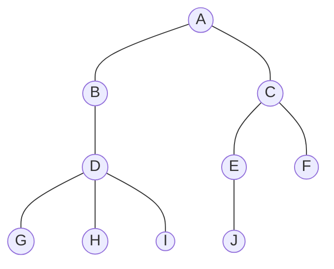
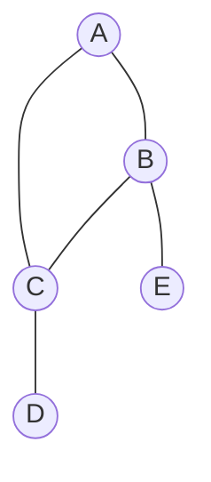
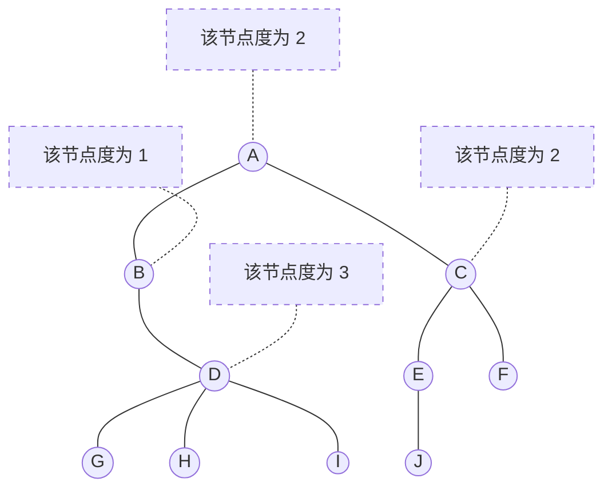
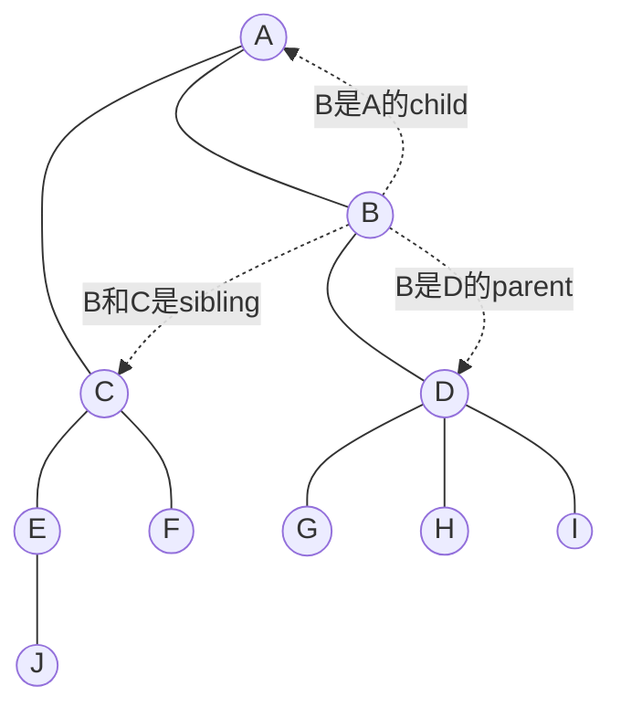
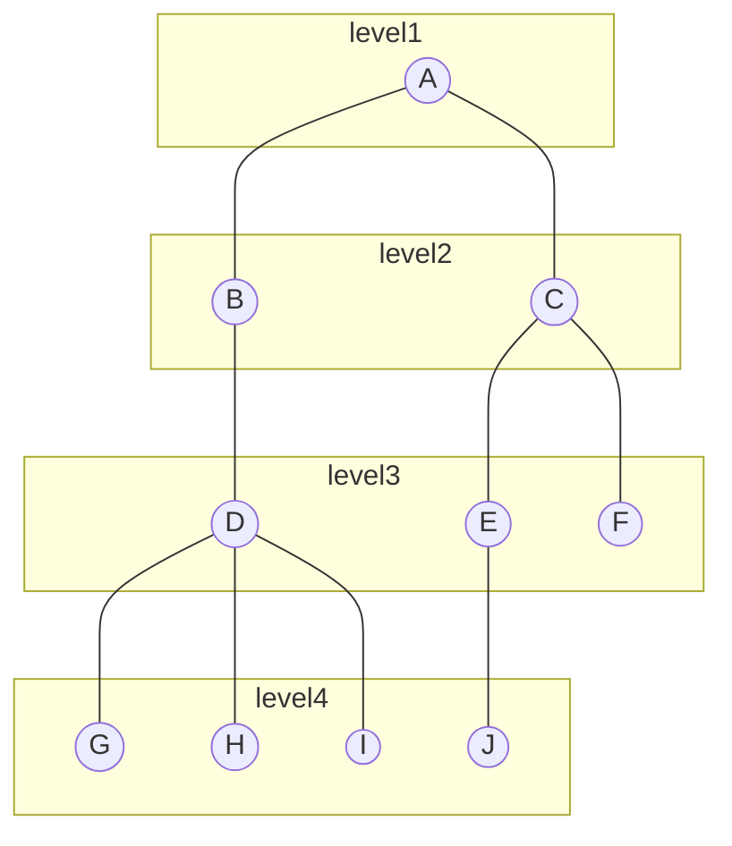
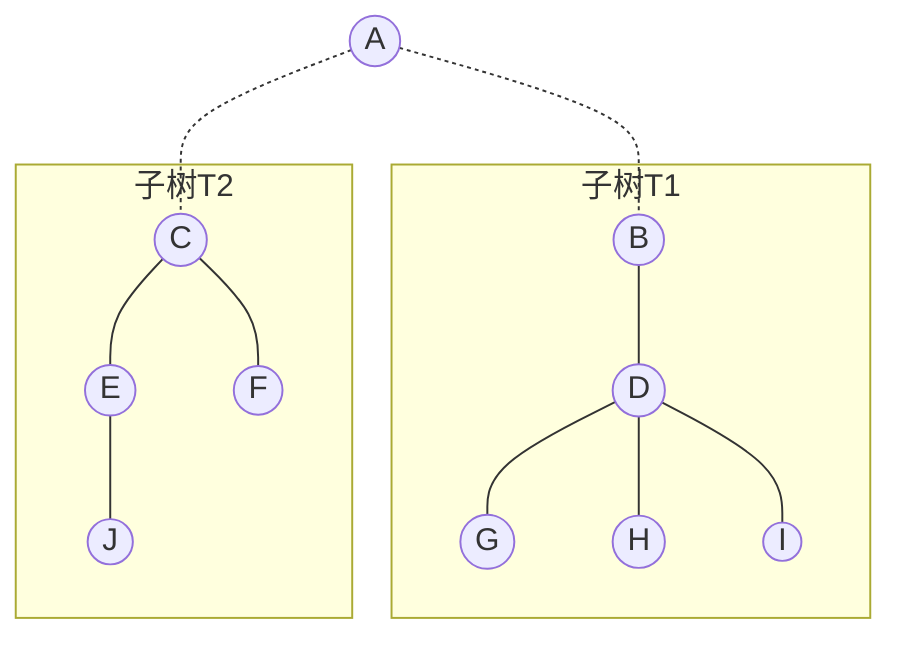

##### 定义
- 树是n个节点的有限集合。
- n=0时，称之为空树。
- 在任意一棵非空树中
  - 有且只有一个特定的节点，称之为根
  - 当n>1时，其余节点可以分为m个互不相交的有限集$T_1,T_2,\dotsi,T_m$,其中每一个集合又是一棵树，并称之为子树

```
[mermaid]语法参考文档：https://mermaid-js.github.io/mermaid/#/
--- 无箭头
--> 有箭头
```

注意一下两点：
1. n>0时，根节点是唯一的，不可能存在多个根节点。
2. m>0时，子树的个数没有限制，但他们一定是互补交互的。像以下结构就不符合树的结构，因为有交叉子树(B---C)


##### 结点分类
- 树的结点包含一个数据元素以及若干指向其子树的分支。
- 结点拥有的子树称之为结点的度（Degree）。度为0的节点称之为叶结点（Leaf）或者终端结点；度不为0的节点结点称之为分支结点或非终端结点。除根节点之外，分支结点也被称之为内部结点。树的度是树内各个结点的度的最大值。
**下面这棵树的度为3**

- 结点子树的根称之为该节点的孩子（Child），相应的，该节点称之为孩子的双亲（Parent）。
- 同一个Parent下的Children之间互相称之为兄弟（Sibling）。
- 结点的祖先是从根到该结点所经分支上的所有结点。
- 以某结点为根的子树中的任意结点都称之为该结点的子孙。


##### 树的层
- 结点的层次（Level）从根开始定义，根为第一层，根的孩子是第二层，根的孩子的孩子为第三层，以此类推
- 树中结点的最大层称为树的深度（Depth）或者高度
**下面这棵树深度为4**

- 如果将树中结点的各子树看成从左到右是有次序的，不能互换的，则称该树为有序树，否则为无序树。
- 森林（Forest）是m（m>0）棵互不相交的树的集合。
**下面两颗子树就可以理解为森林**

##### 树的抽象数据类型
```go
ADT树(tree)
Data
  树是由一个根结点和若干棵子树构成的。树中结点具有相同的数据类型及层次关系。
Operation
  InitTree() *T // 构造一棵空树
  DestoryTree(t *T) // 销毁一颗树
  CreateTree(d definition) *T // 根据定义创建一棵树
  ClearTree(t *T) // 若树存在，则将树清空为空树
  TreeEmpty(t *T) bool// 判断是否为空树，是 true 否 false
  TreeDepth(t *T) int // 返回tree的深度
  Root(t T) Element// 返回tree的根结点
  Value(t T,cur_e Element) // 返回树中某个结点的值
  Assign(t T,cur_e Element,value int) // 给树的结点赋值为value
  Parent(t T,cur_e Element) // 如果cur_e不是根结点，返回它的Parent
  LeftChild(t T,cur_e Element) Element // 若cur_e不是叶结点，则返回它的左孩子结点
  RightSilbing(t T,cur_e Element) Element// 若cur_e有右兄弟,则返回它的右兄弟，否则返回空
  InsertChild(t *T,*p,i,c) // 其中p指向树T的某个结点，i为所指结点p的度上加一,非空树c与T不相交,操作结果为插入c为树T中p指结点的第i棵子树
  DeleteChild(t *T,*p,i) // 其中p指向树T的某个结点,i为所指结点p的度,操作结果为删除T中p所指结点的第i棵子树。
endADT
```

树的结构右两种表示方法：
1. 双亲表示法
2. 孩子表示法

```
存储结构的设计是一个非常灵活的过程。一个存储结构设计的是否合理，取决于该存储结构的运算是否合适、是否方便，时间复杂度好不好。
```


